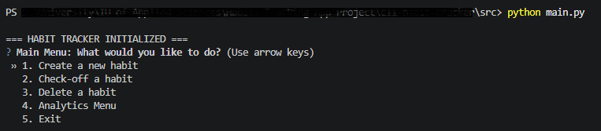
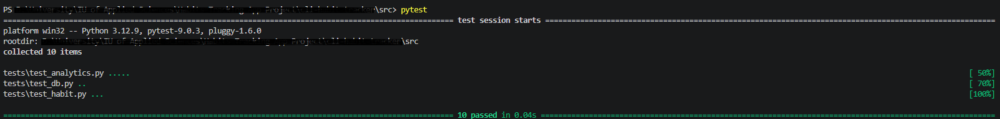

# CLI Habit Tracker

A lightweight, terminal-based habit tracking application built with Python and SQLite. This project implements a hybrid architecture, strictly separating stateful Object-Oriented database interactions from pure functional analytics.

Developed as a core project for the B.Sc. Cyber Security curriculum at IU International University of Applied Sciences.

## 🏗️ Architecture & Design

This application is engineered around a fully decoupled structure:

* **Persistence Layer (`database.py`):** Encapsulates SQLite connection logic and enforces schema constraints, including robust `ON DELETE CASCADE` rules to prevent orphaned records.
* **Object-Oriented Logic (`habit.py`):** Manages the individual state and lifecycle of habit objects. It uses dependency injection to delegate all storage operations to the persistence layer without tightly coupling the classes.
* **Functional Analytics (`analytics.py`):** A pure functional module that evaluates habit streaks. It handles complex time-series data (including leap years, weekly frequency gaps, and consecutive daily logging) using pure functions like `reduce` and `map` without mutating external state.
* **Interactive CLI (`main.py`):** A polished terminal interface powered by `questionary` for safe, strictly-typed user inputs, preventing invalid data entry or SQL injection vectors.

## 🚀 Installation & Setup

1. **Clone the repository:**
   ```bash
   git clone https://github.com/x0Mo3tAsmx0/CLI-Habit-Tracker.git
   cd CLI-Habit-Tracker
   ```

2. **Install dependencies:**
   The application requires `questionary` for the terminal interface and `pytest` for the testing suite.
   ```bash
   pip install questionary pytest
   ```

## 💻 Usage

To start the interactive terminal application, navigate to the `src` directory and run the main controller:

```bash
cd src
python main.py
```

### Application Interface


*Note: On the first execution, the application will automatically initialize the SQLite database (`habits.db`) and inject a 28-day mock historical dataset. This allows you to immediately test the analytics engine without having to manually log a month's worth of data.*

## 🧪 Testing Suite

This project includes a comprehensive, 10-point test suite utilizing Pytest. 

The suite verifies database schema creation, OOP cascading deletions, and the complex functional reducer logic required for accurate streak calculations across different periodicities. All tests run against an isolated, temporary `:memory:` database to completely protect production data during execution.

To execute the test suite, ensure you are in the `src` directory and run Pytest as a module to ensure paths resolve correctly:

```bash
cd src
python -m pytest
```

### Test Execution
